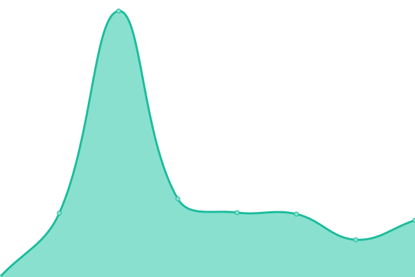

# [📈 Live Status](https://rdp-studio.github.io/upptime): <!--live status--> **🟧 Partial outage**

This repository contains the open-source uptime monitor and status page for [rdp-studio](https://rdp-studio.github.io/upptime), powered by [Upptime](https://github.com/upptime/upptime).

With [Upptime](https://upptime.js.org), you can get your own unlimited and free uptime monitor and status page, powered entirely by a GitHub repository. We use [Issues](https://github.com/rdp-studio/upptime/issues) as incident reports, [Actions](https://github.com/rdp-studio/upptime/actions) as uptime monitors, and [Pages](https://rdp-studio.github.io/upptime) for the status page.

<!--start: status pages-->
<!-- This summary is generated by Upptime (https://github.com/upptime/upptime) -->
<!-- Do not edit this manually, your changes will be overwritten -->

| URL                                          | Status  | History                                                                                             | Response Time                                                                       | Uptime                                                                                                                                                                                                                           |
| -------------------------------------------- | ------- | --------------------------------------------------------------------------------------------------- | ----------------------------------------------------------------------------------- | -------------------------------------------------------------------------------------------------------------------------------------------------------------------------------------------------------------------------------- |
| [RDPAI](https://rdpai.utools.club)           | 🟩 Up   | [rdpai.yml](https://github.com/rdp-studio/upptime/commits/master/history/rdpai.yml)                 |  2047ms         |                  |
| [SuperPi@Home](https://piathome.utools.club) | 🟥 Down | [super-pi-home.yml](https://github.com/rdp-studio/upptime/commits/master/history/super-pi-home.yml) |  1065ms |  |

<!--end: status pages-->

[**Visit our status website →**](https://rdp-studio.github.io/upptime)

## 📄 License

- Code: [MIT](./LICENSE) © [rdp-studio](https://rdp-studio.github.io/upptime)
- Data in the `./history` directory: [Open Database License](https://opendatacommons.org/licenses/odbl/1-0/)
